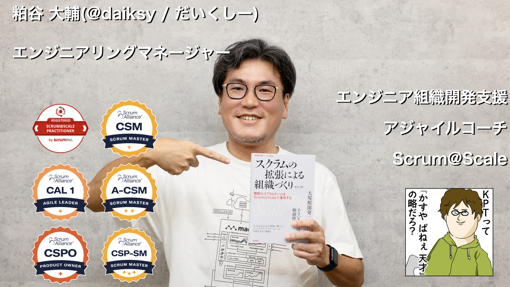

- 氏名: 粕谷大輔
  - Twitter: @daiksy
  - Facebook: daiksy
  - github: daiksy
  - blog: [https://daiksy.hatenablog.jp/](https://daiksy.hatenablog.jp/)
  - 過去の登壇資料: [https://speakerdeck.com/daiksy](https://speakerdeck.com/daiksy)
  - その他だいたいのインターネットのアカウントはdaiksyです

## 資格
- [https://www.scrumalliance.org/community/profile/dkasuya](https://www.scrumalliance.org/community/profile/dkasuya)
  - Certified ScrumMaster®
  - Certified Scrum Product Owner®
  - Advanced - Certified ScrumMaster®
  - Certified Agile Leader® 1
  - Certified Scrum Professional® - ScrumMaster
- Registered Scrum@Scale Practitioner™

## 公式記録が存在する趣味
- ルービックキューブを30秒くらいで解けます
  - [https://www.worldcubeassociation.org/persons/2019KASU01](https://www.worldcubeassociation.org/persons/2019KASU01)

## 学歴
- 2001年奈良大学文学部国文学科卒

## 職歴
### 社歴
- 2024年5月~          株式会社はてな
- 2021年5月~2024年4月  Chatwork株式会社(現:株式会社kubell)
- 2014年11月~2021年4月 株式会社はてな
- 2012年2月~2014年10月 フリュー株式会社
- 2006年7月~2012年1月  株式会社第一コンピュータリソース
- 2005年7月~2006年6月  株式会社エス・エーシー
- 2001年4月~2005年5月  株式会社ギガ・システム

### 副業
- Chatwork株式会社(現:株式会社kubell)
  - 2019年4月~6月
    - エンジニアリングマネージメント支援
- 株式会社トマルバ
  - 2018年11月~2019年12月
    - エンジニア組織開発支援
- enPiT AiBiC
  - [https://aibic.enpit.jp/](https://aibic.enpit.jp/)
  - 2021年9月, 2020年9月, 2019年9月それぞれ4日間ずつ
  - 文科省の教育事業。東工大からの依頼で期間中のファシリテーションを担当

## 代表的な講演・執筆など

### 講演/登壇
- Developers Summit 2025 Kansai
- DevOpsDays Tokyo 2025 (Opening Keynote)
- Engineering Manager Conference Japan 2025
- Scrum Fest Osaka 2024
- Scrum Fest Fukuoka 2023
- Scrum Interaction 2022
- Regional Scrum Gathering Tokyo 2022
- Scrum Fest Osaka 2021
- Developers Summit 2020
- Developers Summit 2020 Kansai
- Developers Summit 2020 Summer
- Scrum Fest Osaka 2020
- builderscon tokyo 2019
- builderscon tokyo 2018
- Regional Scrum Gathering Tokyo 2018
- Developers Summit 2018
- Developers Summit 2018 KANSAI 
- ScalaMatsuri2018
- 過去の登壇資料: [https://speakerdeck.com/daiksy](https://speakerdeck.com/daiksy)

### 著書/記事執筆
- スクラムの拡張による組織づくり──複数のスクラムチームをScrum@Scaleで運用する (技術評論社)
  - 書き下ろし単著 
- Sofware Design 2023年8月号 (技術評論社)
  - アジャイル開発の課題に立ち向かう
  - 第2章を担当 
- AMBI(旧エンジニアHub) Scrum@Scaleの基本と実装 - Chatworkの実践に学ぶ「スケールするスクラム」の導入戦略
  - [https://en-ambi.com/itcontents/entry/2021/09/29/103000](https://en-ambi.com/itcontents/entry/2021/09/29/103000)
- Software Design 2021年2月号 (技術評論社)
  - Web API設計・開発入門
  - 第4章を担当
- Web+DB PRESS vol.119 (技術評論社)
  - インフラ障害対応演習
  - 特集全般を担当
- わかばちゃんと学ぶサーバー監視 (C&R研究所)
  - 監修とコラムの執筆を担当
- Mackerelサーバ監視［実践］入門 (技術評論社)
  - 共著
- Findy Engineer Labコラム
  - [https://engineer-lab.findy-code.io/coder-to-em](https://engineer-lab.findy-code.io/coder-to-em)
- ProductZine連載
  - [https://codezine.jp/article/corner/817](https://codezine.jp/article/corner/817)
  - 第1回の執筆と、それ以降のキュレーション

## 職務経歴

### 2024年~
- 株式会社はてな 組織・基盤開発本部 技術グループ長
  - 100名を超えるエンジニア組織全体のマネージメントを担当しています。
  - エンジニア組織の採用に責任を持ち、エンジニアやEMの採用に成功しています。
  - サマーインターンシップの責任者として、企画・実行を担当しています。
  - エンジニアのキャリアラダーの作成や、タレントマネジメントを推進しています。

### 2021年~2024年
- Chatwork エンジニアリングマネージャ/アジャイルコーチ
  - Chatworkのアーキテクチャ刷新プロジェクトにて、Scrum@Scaleを用いた組織づくりを行いました。
  - スクラムマスターやアジャイルコーチの採用責任を持ちました。採用・育成を推進し、社内のアジャイル文化を整えてました。2023年時点で社内に8名のスクラムマスター・アジャイルコーチがおり、お互いに知見を共有しあう「スクラムマスターギルド」を立ち上げました。
  - アジャイルコーチの複数名の採用に成功しました。
  - ジョン・コッターの8アクセルを軸に、社内の開発組織を変革する組織変革チームを立ち上げました。
  - エンジニア組織でピープルマネジメントを担当し、20名ほどのメンバーを担当しました。
  - 新卒採用を担当し、書類選考・技術面接を担当していました。また、新卒育成ラダーの作成にも関わりました。
- Chatwork SRE部マネージャ(兼務)
  - SREの採用にコミットメントし、複数名の採用に成功しました。

### 2017年~2021年
- Mackerelチーム ディレクター
  - アプリケーションエンジニア/SRE/デザイナーのチームを取りまとめ、プロダクトのデリバリーに責任を持っていました。
  - 2018年7月にローンチから数えて200週連続リリースを達成し、それを牽引しました。ローンチから4年経ち、プロダクトのフェーズが素早い機能開発よりも、丁寧な開発で価値を出す局面に移行したと判断し、毎週連続リリースをストップする意思決定を行いました。
    - 詳細はこちら: [https://mackerel.io/ja/blog/entry/announcement/20180705](https://mackerel.io/ja/blog/entry/announcement/20180705)
  - ディレクター就任時は、事業全体でもエンジニアメインで10名程度のチームでしたが、現在ではエンジニア以外にもセールスや営業事務なども含めて30名の体制に拡大。セールスエンジニアをCRE(Customer Reliability Engineer)へとコンバートするなど、キャリア面での工夫なども行いつつ、単一チームで事業全体を担える体制の構築に貢献しました。
  - チームではかねてからスクラムを導入していましたが、エンジニアだけで13名を超える体制になり、今年からスクラムオブスクラムの体制に移行。ひとつのプロダクトバックログを共有しつつも、チームは複数にわかれてそれぞれプロジェクト制で動く体制を構築しました。
  - 現場ディレクションでは、Mackerelのロール内異常検知という機能で、社内でも例の少ない機械学習プロジェクトを指揮し、リリースの成功に導きました。機械学習プロジェクトは不確実性の高さから従来のマネージメント手法だけでは制御が難しいプロジェクトですが、機械学習プロジェクトの特性をキャッチアップし、現場のエンジニアからも評価されるマネージメントができました。
    - 上記のとりくみを[われわれはいかにして 機械学習プロジェクトの マネージメントをすべきか](https://speakerdeck.com/daiksy/builderscon-tokyo-2019)としてbuildersconで発表しました。
  - Mackerelでは社内でもさきがけてSREingに取り組んでおり、SLI/SLOに基づいてエラーバジェットを管理してメンテナンスタイミングや、開発計画に反映させていました。当時はAngularJSからReactへ移行する大きなプロジェクトが動いており、フロントエンドはその性質上本番環境が壊れる、ということが度々起こりますが、エラーバジェットを管理しているため、壊れることを気にするよりも、壊れてもすぐに戻す、という体制を構築してアグレッシブな開発を行っており、その考え方の展開をチームのSREをサポートしつつ取り組みました。
  - Mackerelチームで定期的な障害対応演習を実施。その様子をWeb+DB PRESS vol.119 (技術評論社)に「インフラ障害対応演習」としてまとめ、寄稿しました。
  - Mackerelチームでの取り組みのいくつかをまとめ、[プロダクトを10年運用する チームをつくる](https://speakerdeck.com/daiksy/devsumi2020)としてDevelopers Summitで発表しました。

- 社内での改善活動
  - Mackerelでのディレクター業務と並行して社内でもいくつか取り組みをしていました
  - マネージメント知見を見込まれて、社内の他のチームの支援をしています。はてなブックマークのリプレースプロジェクト終盤の見積もりの支援などを行い、このプロジェクトに関する経営の意思決定のサポートをしました
  - 全社的にスクラム導入の機運が高まりつつあるため、社内の各チームのスクラムマスター的なポジションのメンバーを集めて、意見交換や教育支援する組織を立ち上げ、2018年から運用しています。ロビー活動の結果、会社の公式なワーキンググループとしても認められ、その後予算も獲得して認定スクラムマスター研修受講者をこれまで7名排出するなどしました。
  - かねてから、社内の中間管理職層のケアが不足しているという課題感があったので、各チームのディレクターを集めて、月1回の定例会や、キャリア/教育の支援を目的とする「ディレクター会」を2019年から立ち上げ、運用していました

### 2014年~2017年
- Mackerelチームアプリケーションエンジニア, その後サブディレクター
- MackerelチームにScalaプログラマとしてジョイン。正式リリースの2ヶ月後で、ほぼプロダクトの立ち上げ期から関わっていることになります。代表的なものとしては、当時LinuxのみだったMackerelの対応OSをWindowsに対応させる開発、[https://kcps-mackerel.io/ja/](https://kcps-mackerel.io/ja/) というKDDIの環境専用のMackerelの開発などを主導しました。SIer時代のスキルや調整力を買われて、パートナー向けの開発を手掛けることが多かった気がします。
- KDDI向けの開発などの社外向けのマネージメントを見込まれてサブディレクターになり、MackerelのオンプレミスからAWSへの移行や、新しい時系列データベースの開発をマネージメントの立場でサポートしました。

### 2012年~2014年
- フリュー株式会社, Scalaプログラマ。その後、開発リーダー
- 女性向けのモバイルゲームのサーバーサイドの開発を手掛けていました。社内で初めてのScalaプロジェクトで、当時コンプガチャ規制という問題の真っ只中で、ガチャのアルゴリズムを大慌てで規制にひっかからないように調整しながら実装しました。
- フリューでは在職中、ゲームを3タイトルてがけ、最後のタイトルでは開発リーダーの立場でした。企画の人とコミュニケーションしながら開発チームのバックログを取りまとめており、開発工数が期間に収まらない企画などは、企画メンバーと一緒にアイデアを出して仕様調整をするなどの裏方をやっていました。

### それ以前
- SIerにて、金融、物流、公共などの中規模開発プロジェクトを多く手掛けていました。エンジニアリングマネージャー観点では特筆するエピソードも少なく、また時期も古いので詳細は割愛します。
